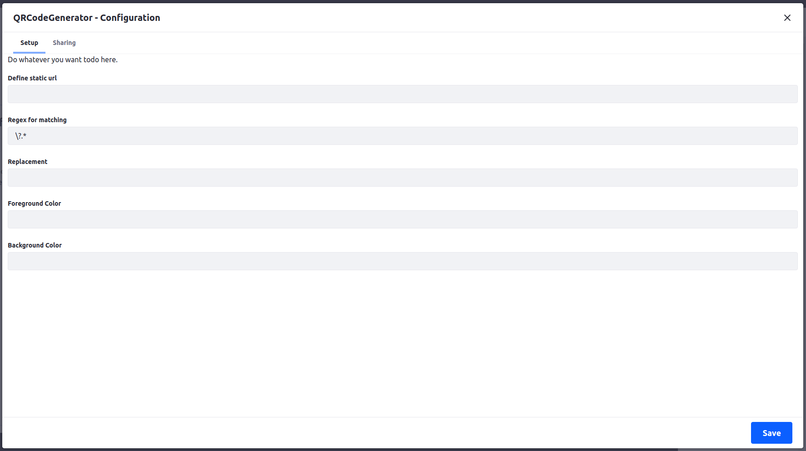
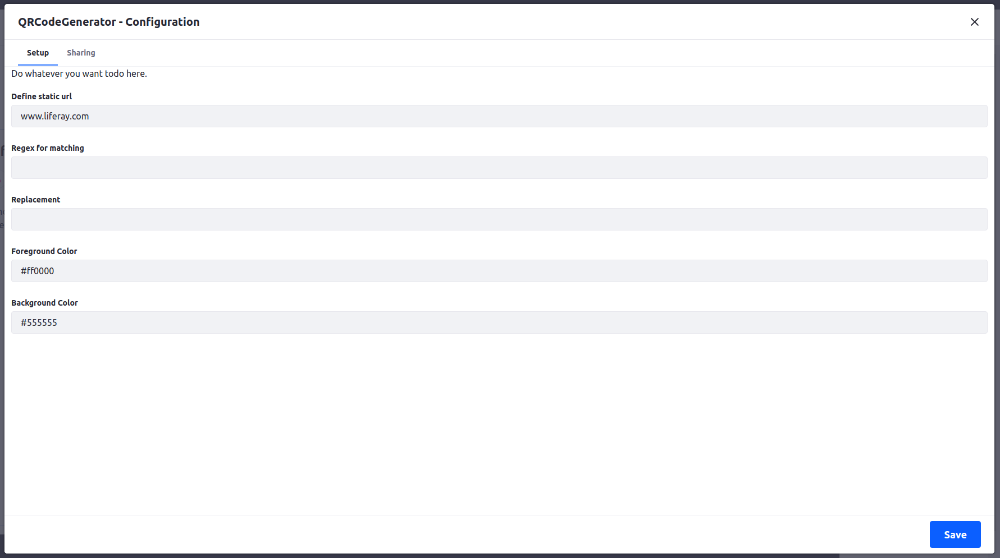

Current version for Liferay 7.3

Todo:
- add configuration option for 
  - static url
  - regex to replace parts of url like strip ?....
  - foreground / background colors
  
  Widget will create QRCode and uses the current URL and removes all query params including '?'
  
  
  Widget will create QRCode and use the statically defined URL and show with red foreground and gray background 
  
  
  Result using above settings
  